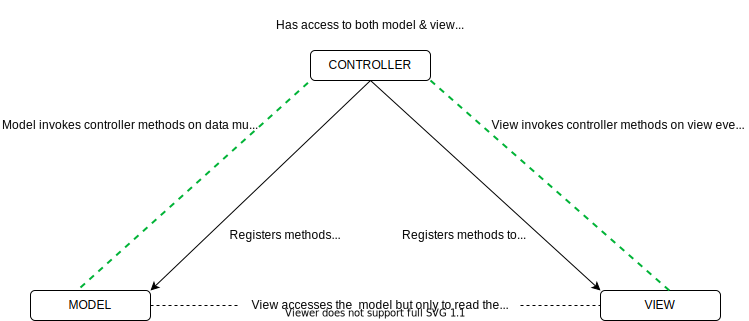

# Architecture

Architectural design patterns are the ways in which we tie our code together. If we have a dozen different modules, it is how those modules talk to each other that defines our architecture.

There are quite a few architectural design patterns - MV* such as MVC, MVP, and MVVM. React uses a variation of MVC called Flux

## MVC (Model-View-Controller)

The MVC pattern provides us with a way to separate our various concerns. It prescribes where we should put logic about business decisions (that is, in Models) and where we should put logic about displaying things to the user (that is, Views). 

Additionally, it gives us the Controller, which enables these two concerns to talk to each other. 

**The benefit**

The separation that MVC fosters is hugely beneficial as it means our fellow programmers can easily discern where to make required changes or fixes.

**Model**

Contains:
- Data
- Business logic to mutate the data. 
- Provides hooks the outer world (i.e Controller) to listen to data mutations (ex: callback registration)

**View**

Contains:
- Business logic to update the UI. Handles low-level display logic i.e How model must be rendered to the UI (ex: DOM API interaction, etc)
- Provides hooks to the outer world (i.e Controller) to listen to UI events such as clicks, input, and so on (ex: callback registration)

Note: The view also has access to the model directly but uses it only to read the data (read-only)

**Controller**

The controller is a *bridge* that glues together the model and view and allows them to interact.

Contains:
- Logic to hook into the view (ex: via callbacks) know when the user requests a change via view
  - It will forward the message to the model
- Logic to hook into the model (ex: via callbacks) to know when the model data has updated
  - It will forward the message to the view

**MVC Flow Diagram**



**Example of MVC to modify a count**

```javascript
// Model
class CountModel {
  // Save the initial data
  constructor(count) {
    this.count = count
  }

  // Business logic to manipulate data
  increment() {
    this.count++
    this.callback()
  }

  decrement() {
    this.count--
    this.callback()
  }

  // Hooks to controller when data changes
  registerCallback(callback) {
    this.callback = callback
  }
}
```

```javascript
// View
class CountView {
  // Has access to the model (to read data from it)
  constructor(model) {
    this.model = model
  }

  // Hooks to controller when UI interaction occurs via user
  registerUserIncrement(userIncrementCallback) {
    this.userIncrementCallback = userIncrementCallback
  }

  registerUserDecrement(userDecrementCallback) {
    this.userDecrementCallback = userDecrementCallback
  }

  // Low level render logic (DOM interaction)
  renderInitial() {
    this.$counter = document.createElement('div')
    this.$counter.innerText = this.model.count

    this.$incrementButton = document.createElement('button')
    this.$incrementButton.innerText = '+'
    this.$incrementButton.addEventListener('click', this.userIncrementCallback)

    this.$decrementButton = document.createElement('button')
    this.$decrementButton.innerText = '-'
    this.$decrementButton.addEventListener('click', this.userDecrementCallback)

    this.$container = document.createElement('div')
    this.$container.appendChild(this.$counter)
    this.$container.appendChild(this.$incrementButton)
    this.$container.appendChild(this.$decrementButton)

    return this.$container
  }

  // The other business logic to update UI (via controller)
  renderUpdate() {
    this.$counter.innerText = this.model.count
  }
}
```

```javascript
// Controller
class CountController {
  constructor(model, view) {
    // Needs both the model and view to be able to work
    this.model = model
    this.view = view

    // Registers the model hooks & invokes view methods 
    // that need to know about model changes:
    this.model.registerCallback(() => {
      this.view.renderUpdate()
    })

    // Registers the view hooks & invokes model methods 
    // that need to know about view events:
    this.view.registerUserIncrement(() => {
      this.model.increment()
    })
    this.view.registerUserDecrement(() => {
      this.model.decrement()
    })
  }
}
```

**What if we don't use MVC?**

Why can't the View just communicate with the Model directly and vice versa? 

Well, it can! But if we did that, we'd be polluting both our View and our Model with more logic and hence more complexity. It gets unwieldy very soon.

With MVC, the degree and quantity of separation will vary with every project you pursue but the central theme of _separation between Model and View_ has persisted through the decades (since 1978)